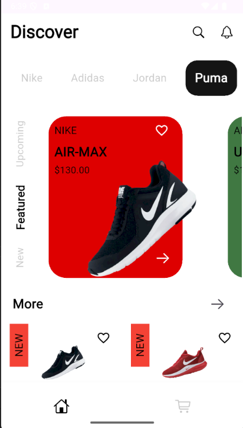
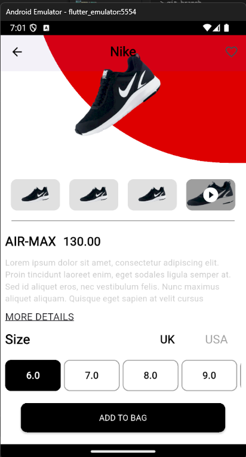
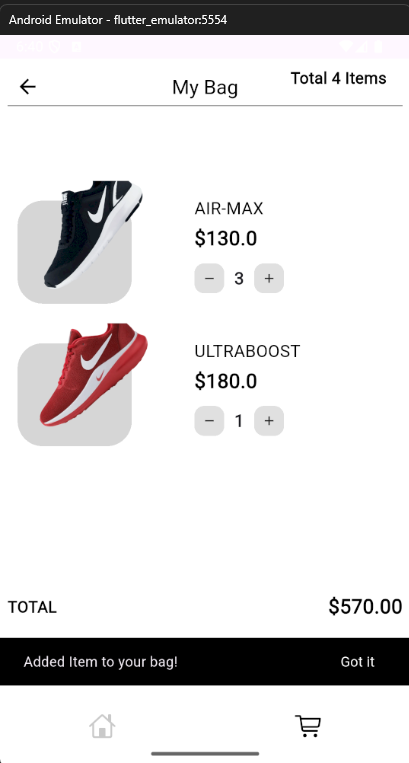

# Shopping Application

A shopping application built with Flutter.

## Table of Contents
- [Overview](#overview)
- [Folder Structure](#folder-structure)
- [Prerequisites](#prerequisites)
- [Setup and Configuration](#setup-and-configuration)
- [Running the App](#running-the-app)

## Overview
This is a sample Flutter shopping app. It demonstrates navigation, state management, and UI design for a mobile commerce experience.

## Folder Structure
```
shop_app/
├── assets/         # Images, fonts, and other assets
│   ├── fonts/
│   └── images/
├── lib/            # Main source code
│   ├── models/     # Data models
│   ├── screens/    # App screens (UI pages)
│   ├── services/   # Business logic/services
│   ├── theme/      # Theme and styling
│   ├── utils/      # Utility functions
│   └── widgets/    # Reusable UI components
├── pubspec.yaml    # Project metadata and dependencies
└── README.md       # Project documentation
```

- **assets/**: Contains images and fonts used in the app. Add your own images to `assets/images/`.
- **lib/**: The main Dart source code. Organize your screens, models, services, and widgets here.
- **pubspec.yaml**: Declares dependencies and assets.
- **README.md**: This file.

## Prerequisites
- [Flutter SDK](https://docs.flutter.dev/get-started/install) (3.x recommended)
- Dart SDK (comes with Flutter)
- An IDE such as [Android Studio](https://developer.android.com/studio) or [VS Code](https://code.visualstudio.com/)
- An Android/iOS emulator or a physical device

## Screenshots

Below are some screenshots of the app in action:

| Home Screen | Details Screen | Bag Screen |
|:-----------:|:-------------:|:----------:|
|  |  |  |

## Setup and Configuration
1. **Clone the repository**
   ```bash
   git clone https://github.com/antonyjm462/shop-app.git
   cd shop-app
   ```
2. **Get dependencies**
   ```bash
   flutter pub get
   ```
3. **(Optional) Configure assets**
   - Images are located in `assets/images/`.
   - Fonts are in `assets/fonts/`.

## Running the App
1. **Start an emulator** (or connect a device)
2. **Run the app**
   ```bash
   flutter run
   ```
   - For Android: Select an Android device/emulator.
   - For iOS: Select an iOS device/simulator (macOS required).

