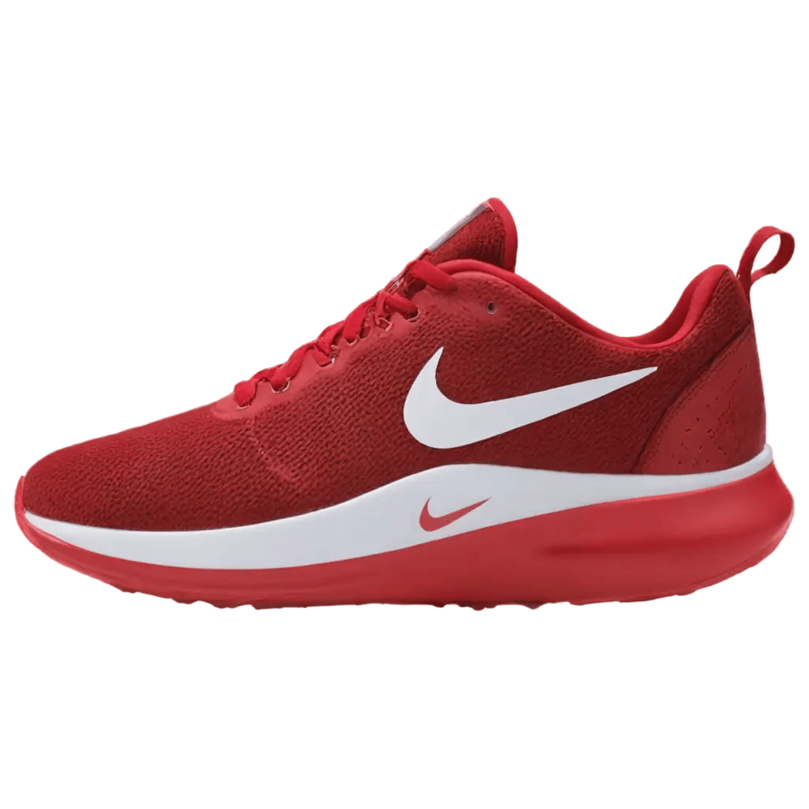

# shop_app

A shopping application built with Flutter.

## Table of Contents
- [Overview](#overview)
- [Prerequisites](#prerequisites)
- [Setup and Configuration](#setup-and-configuration)
- [Running the App](#running-the-app)
- [Adding Screenshots](#adding-screenshots)
- [Screenshots](#screenshots)

## Overview
This is a sample Flutter shopping app. It demonstrates navigation, state management, and UI design for a mobile commerce experience.

## Prerequisites
- [Flutter SDK](https://docs.flutter.dev/get-started/install) (3.x recommended)
- Dart SDK (comes with Flutter)
- An IDE such as [Android Studio](https://developer.android.com/studio) or [VS Code](https://code.visualstudio.com/)
- An Android/iOS emulator or a physical device

## Setup and Configuration
1. **Clone the repository**
   ```bash
   git clone <your-repo-url>
   cd shop_app
   ```
2. **Get dependencies**
   ```bash
   flutter pub get
   ```
3. **(Optional) Configure assets**
   - Images are located in `assets/images/`.
   - Fonts are in `assets/fonts/`.
   - You can add your own images to `assets/images/` and update `pubspec.yaml` if needed.

## Running the App
1. **Start an emulator** (or connect a device)
2. **Run the app**
   ```bash
   flutter run
   ```
   - For Android: Select an Android device/emulator.
   - For iOS: Select an iOS device/simulator (macOS required).

## Adding Screenshots
To add screenshots to this README:
1. Take a screenshot on your emulator/device.
2. Save the screenshot in the `assets/images/` directory (e.g., `assets/images/screenshot1.png`).
3. Reference the screenshot in the README using Markdown:
   ```markdown
   
   ```

## Screenshots
Here are some example images from the app:

| Home Screen | Product Detail | Bag Screen |
|-------------|---------------|------------|
|  |  |  |